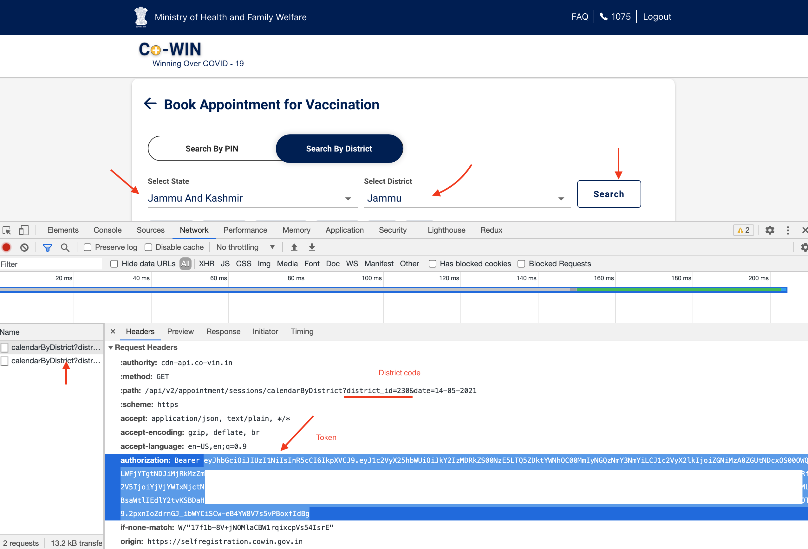
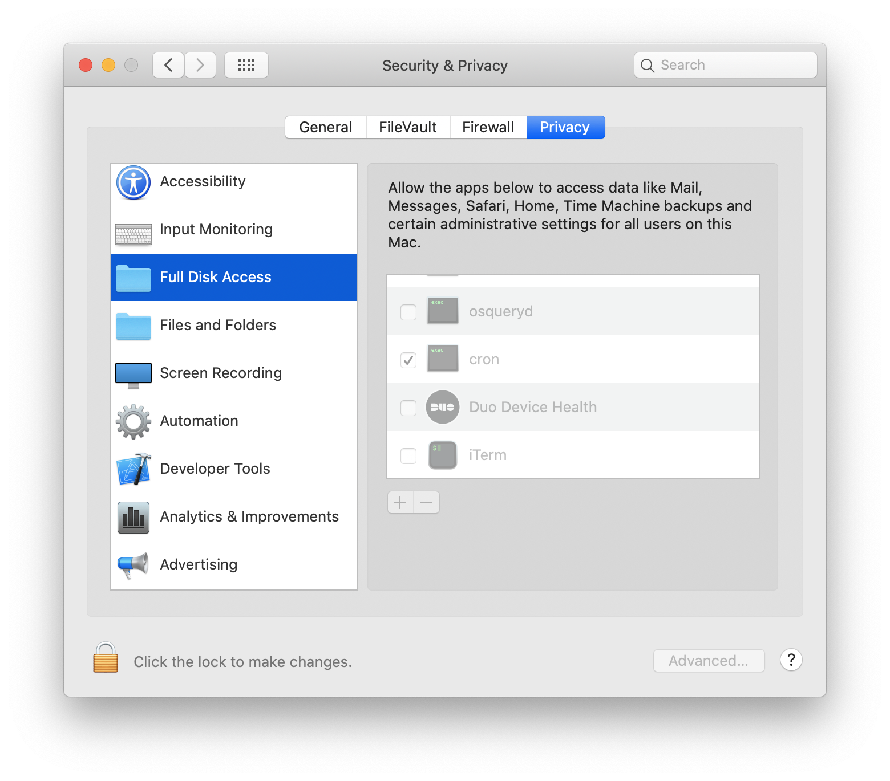
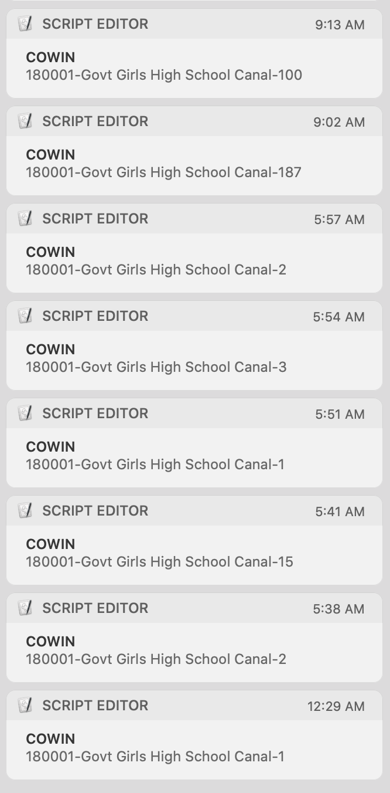

# Read me

Cowin vaccine availability Mac OS notifier. This is suppose to work only for Mac OS, has not been customized for other platforms.

## Setup
- Requirements
	- bash
	- python3
	- cron
	- xcode command line tools i.e `sudo xcode-select --install` if you need to.

- git clone/download on desktop i.e `~/Desktop/cowin`
- Customize your params, edit `cowin.sh`

```
DISTRICT=230
TOKEN="TOKEN_HERE"
```

Get your `DISTRICT` code and `TOKEN` from cowin.



- add crontab entry i.e

```
$ crontab -e
* * * * * ~/Desktop/cowin/cowin.sh > ~/Desktop/cowin/cowin.log
```

This will run the script every minute & log the run in cowin.log for debug purpose.


#### Full disk access



Writting `cowin.log` requires disk access, you can give `cron` `full disk access`. If you need to know where is cron binary try.

```
$ whereis cron
```

It's usually in `/usr/sbin/cron`.


### Debug
```
$ tail -f ~/Desktop/cowin/cowin.log
```

You shoud be some entry in cowin.log if the script is triggered by cron. If there is some miss-configuration then check.

```
$ cat /var/mail/$USER
```

If everything is working well, you will get notification with sound whenever vaccine slot is available. You can check notification tab too for any older notification.

The notification format is `pincode - name of vaccine center - total seats available`, the availability is checked for next 7 days.


